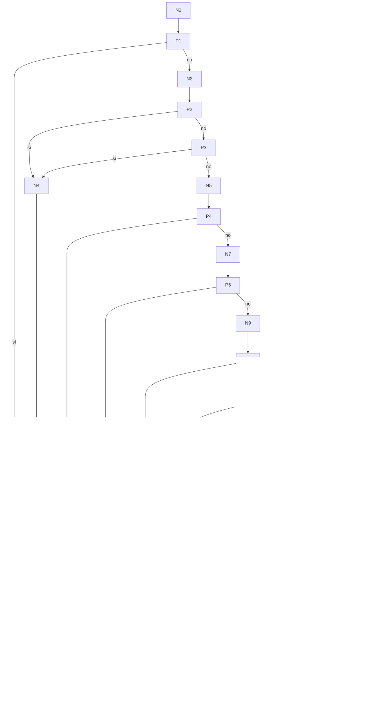

# Prueba de caja blanca 01 — `enviar_flag`

- **Módulo:** `itdb_ctf/core/envio_logic.py`
- **Función:** `enviar_flag(id_usuario, id_reto, id_evento, flag_enviada) -> (bool, str)`
- **Propósito:** validar y registrar el envío de una flag por un estudiante.
- **Técnica:** camino básico (McCabe) + cobertura de ramas con `pytest-cov`.
- **Archivo de pruebas:** `tests/test_01_enviar_flag.py`

---

## 1. Código fuente con nodos numerados

```python
10  def enviar_flag(id_usuario, id_reto, id_evento, flag_enviada):
11      ok, faltan = permitir_flag(id_usuario, id_reto)            # N1
12      if not ok:                                                 # P1
13          return False, "Demasiados intentos..."                 # N2
14      with Session(engine) as s:                                 # N3
15          reto = s.get(Reto, id_reto)                            # N3
16          if not reto or not reto.activo:                        # P2 (not reto) / P3 (not activo)
17              return False, "Reto no disponible."                # N4
18          cont = s.exec(select(Contiene)...).first()             # N5
19          if not cont:                                           # P4
20              return False, "El reto no pertenece a este evento."# N6
21          ev = s.get(Evento, id_evento)                          # N7
22          if not ev:                                             # P5
23              return False, "Evento no disponible."              # N8
24          est_evento = estado_evento(ev)                         # N9
25          if est_evento == "futuro":                             # P6
26              return False, "El evento aún no ha iniciado."      # N10
27          if est_evento == "concluido":                          # P7
28              return False, "El evento ha finalizado."           # N11
30-35       inscrito = s.exec(select(Participa)...).first()        # N12
36          if not inscrito:                                       # P8
37              return False, "No estás inscrito en este evento."  # N13
39-44       resuelto = s.exec(select(Resuelve)...).first()         # N14
45          if resuelto:                                           # P9
46              return False, "El reto ah sido resuelto."          # N15
47-53       correcta = flag_hasher.verificar(...); s.add(Resuelve) # N16
54          if correcta:                                           # P10
55-59           refrescar_puntaje(...); commit; publicar; return True  # N17
60-61       s.commit(); return False, "Flag incorrecta."           # N18
                                                                   # F (fin)
```

La condición compuesta de la línea 16 (`not reto or not reto.activo`) se separa
en dos nodos predicado (P2 y P3), como pide McCabe para condiciones múltiples.

## 2. Grafo de flujo



(Para obtener la imagen: pegar el bloque en https://mermaid.live y exportar PNG/SVG.)

## 3. Complejidad ciclomática V(G)

| Método | Cálculo | Resultado |
|---|---|---|
| Nodos predicado | P = 10 → V(G) = P + 1 | **11** |
| Aristas y nodos | E = 38, N = 29 → V(G) = E − N + 2 = 38 − 29 + 2 | **11** |
| Regiones | 10 regiones cerradas + 1 exterior | **11** |

Hay **11 caminos independientes**.

## 4. Caminos independientes

| Camino | Recorrido | Descripción |
|---|---|---|
| C1 | N1 → P1(sí) → N2 → F | Superó el límite de envíos |
| C2 | … → P2(sí) → N4 → F | El reto no existe |
| C3 | … → P2(no) → P3(sí) → N4 → F | El reto existe pero está inactivo |
| C4 | … → P4(sí) → N6 → F | El reto no está asociado al evento |
| C5 | … → P5(sí) → N8 → F | El evento no existe — **no factible** (ver nota) |
| C6 | … → P6(sí) → N10 → F | El evento aún no inicia |
| C7 | … → P7(sí) → N11 → F | El evento ya finalizó |
| C8 | … → P8(sí) → N13 → F | El usuario no está inscrito (o está descalificado) |
| C9 | … → P9(sí) → N15 → F | El usuario ya resolvió ese reto |
| C10 | … → P10(sí) → N17 → F | Flag correcta |
| C11 | … → P10(no) → N18 → F | Flag incorrecta |

**Nota sobre C5 (camino no factible):** para llegar a P5 primero hay que pasar P4,
que exige una fila en `Contiene` con ese `id_evento`. La clave foránea
`contiene.id_evento → evento.id_evento` garantiza que ese evento existe, así que
`s.get(Evento, id_evento)` nunca devuelve `None` en ese punto. La línea 23 es
código defensivo inalcanzable; no se le escribe caso de prueba.

## 5. Casos de prueba

Escenario base (lo arma la fixture `escenario`): un evento cerrado **activo**
(inició ayer, termina mañana), un reto activo con flag `ITDB{flag_correcta}`
asociado al evento con 100 pts estáticos, y un estudiante **inscrito**.

| Caso | Test | Precondición (sobre el escenario base) | Entrada | Resultado esperado | Resultado obtenido |
|---|---|---|---|---|---|
| C1 | `test_C1_supera_rate_limit` | 15 envíos previos en el mismo minuto | 16º envío | `(False, "Demasiados intentos...")`; solo 15 filas en `Resuelve` | Aprobado |
| C2 | `test_C2_reto_inexistente` | — | `id_reto = 9999` | `(False, "Reto no disponible.")` | Aprobado |
| C3 | `test_C3_reto_inactivo` | Reto con `activo = False` asociado | flag correcta | `(False, "Reto no disponible.")` | Aprobado |
| C4 | `test_C4_reto_no_pertenece_al_evento` | Reto creado sin asociar al evento | flag correcta | `(False, "El reto no pertenece a este evento.")` | Aprobado |
| C5 | — | No factible | — | — | N/A |
| C6 | `test_C6_evento_futuro` | Evento que inicia mañana | flag correcta | `(False, "El evento aún no ha iniciado.")` | Aprobado |
| C7 | `test_C7_evento_concluido` | Evento que terminó ayer | flag correcta | `(False, "El evento ha finalizado.")` | Aprobado |
| C8a | `test_C8_usuario_no_inscrito[sin_inscripcion]` | Usuario sin fila en `Participa` | flag correcta | `(False, "No estás inscrito en este evento.")` | Aprobado |
| C8b | `test_C8_usuario_no_inscrito[descalificado]` | Usuario con estado `descalificado` | flag correcta | `(False, "No estás inscrito en este evento.")` | Aprobado |
| C9 | `test_C9_reto_ya_resuelto` | El usuario ya acertó el reto | flag correcta otra vez | `(False, "El reto ah sido resuelto.")`; sigue 1 fila | Aprobado |
| C10 | `test_C10_flag_correcta` | — | `ITDB{flag_correcta}` | `(True, "¡Flag correcta!")`; 1 fila con `flag_correcta = True` | Aprobado |
| C11 | `test_C11_flag_incorrecta` | — | `ITDB{mala}` | `(False, "Flag incorrecta.")`; 1 fila con `flag_correcta = False` | Aprobado |

## 6. Resultados y cobertura

Ejecución: `pytest tests/test_01_enviar_flag.py --cov=itdb_ctf.core.envio_logic --cov-branch --cov-report=term-missing`
(2026-10-02, Python 3.14.5, pytest 9.1.1, BD `ctf_itdb_test`).

**11 de 11 casos aprobados.**

| Archivo | Sentencias | Sin cubrir | Ramas | Ramas parciales | Cobertura | Líneas sin cubrir |
|---|---|---|---|---|---|---|
| `itdb_ctf/core/envio_logic.py` | 44 | 1 | 18 | 1 | **97 %** | 23 |

| Función | Sentencias cubiertas | Ramas parciales | Cobertura |
|---|---|---|---|
| `enviar_flag` (líneas 10–61) | 35 / 36 | 1 (línea 22 → 23) | **97 %** |

La única línea sin cubrir (23, `return False, "Evento no disponible."`) es
exactamente el camino C5, declarado **no factible** en la sección 4. El reporte
de cobertura confirma el análisis: todos los caminos factibles fueron ejecutados.
