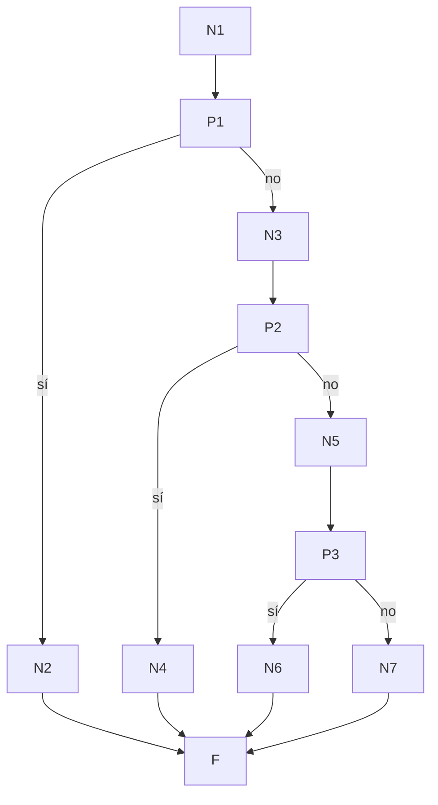

# Prueba de caja blanca 02 — `adquirir_pista`

- **Módulo:** `itdb_ctf/core/compra_logic.py`
- **Función:** `adquirir_pista(id_usuario, id_evento, id_reto, id_pista) -> (bool, str)`
- **Propósito:** comprar una pista descontando su costo del puntaje del estudiante.
- **Técnica:** camino básico (McCabe) + cobertura de ramas con `pytest-cov`.
- **Archivo de pruebas:** `tests/test_02_adquirir_pista.py`

---

## 1. Código fuente con nodos numerados

```python
 7  def adquirir_pista(id_usuario, id_evento, id_reto, id_pista):
 8      with Session(engine) as s:                                  # N1
 9          pista = s.get(Pista, id_pista)                          # N1
10          if not pista:                                           # P1
11              return False, "Pista inexistente"                   # N2
12-16       ad = s.exec(select(Compra)...).first()                  # N3
17          if ad:                                                  # P2
18              return False, "Pista adquirida"                     # N4
19          saldo = puntaje_total_usuario(s, id_usuario, id_evento) # N5
20          if pista.costo > saldo:                                 # P3
21              return False, "Puntos insuficientes..."             # N6
22-33       s.add(Compra(...)); s.commit(); publicar...; return True# N7
                                                                    # F (fin)
```

## 2. Grafo de flujo



## 3. Complejidad ciclomática V(G)

| Método | Cálculo | Resultado |
|---|---|---|
| Nodos predicado | P = 3 → V(G) = P + 1 | **4** |
| Aristas y nodos | E = 13, N = 11 → V(G) = 13 − 11 + 2 | **4** |
| Regiones | 3 cerradas + 1 exterior | **4** |

## 4. Caminos independientes

| Camino | Recorrido | Descripción |
|---|---|---|
| C1 | N1 → P1(sí) → N2 → F | La pista no existe |
| C2 | N1 → P1(no) → N3 → P2(sí) → N4 → F | El estudiante ya compró esa pista |
| C3 | … → P2(no) → N5 → P3(sí) → N6 → F | No le alcanzan los puntos |
| C4 | … → P3(no) → N7 → F | Compra exitosa |

Todos los caminos son factibles.

## 5. Casos de prueba

Escenario base (fixture `escenario`): evento activo; el estudiante resolvió un
reto de 100 pts, así que su **saldo es 100**. Hay un segundo reto donde se crean
las pistas.

C4 se prueba dos veces aplicando **valor límite**: costo menor al saldo y costo
exactamente igual al saldo (la condición es `costo > saldo`, así que con costo =
saldo la compra debe permitirse). C3 usa el valor límite del otro lado
(costo = saldo + 1).

| Caso | Test | Precondición | Entrada | Resultado esperado | Resultado obtenido |
|---|---|---|---|---|---|
| C1 | `test_C1_pista_inexistente` | — | `id_pista = 9999` | `(False, "Pista inexistente")`; 0 compras | Aprobado |
| C2 | `test_C2_pista_ya_adquirida` | Pista de 10 ya comprada | misma pista | `(False, "Pista adquirida")`; sigue 1 compra | Aprobado |
| C3 | `test_C3_puntos_insuficientes` | Pista de costo 101 | esa pista | `(False, "Puntos insuficientes...")`; 0 compras | Aprobado |
| C4a | `test_C4_compra_exitosa[costo_menor_al_saldo]` | Pista de costo 30 | esa pista | `(True, "Pista adquirida.")`; 1 compra de 30 | Aprobado |
| C4b | `test_C4_compra_exitosa[costo_igual_al_saldo]` | Pista de costo 100 | esa pista | `(True, "Pista adquirida.")`; 1 compra de 100 | Aprobado |

## 6. Resultados y cobertura

Ejecución: `pytest tests/test_02_adquirir_pista.py --cov=itdb_ctf.core.compra_logic --cov-branch --cov-report=term-missing`
(2026-10-02, Python 3.14.5, pytest 9.1.1, BD `ctf_itdb_test`).

**5 de 5 casos aprobados.**

| Función | Sentencias cubiertas | Ramas parciales | Cobertura |
|---|---|---|---|
| `adquirir_pista` | 16 / 16 | 0 | **100 %** |
