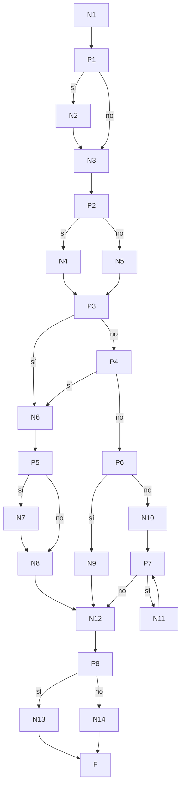

# Prueba de caja blanca 03 — `puntaje_total_usuario`

- **Módulo:** `itdb_ctf/core/puntaje_logic.py`
- **Función:** `puntaje_total_usuario(session, id_usuario, id_evento, corte=None) -> int`
- **Propósito:** calcular el puntaje de un estudiante en un evento: suma de los
  retos resueltos menos los puntos gastados en pistas, nunca menor a 0.
  `corte` es el instante del **freeze** del scoreboard: si viene, solo cuenta lo
  ocurrido hasta ese momento.
- **Técnica:** camino básico (McCabe) + cobertura de ramas con `pytest-cov`.
- **Archivo de pruebas:** `tests/test_03_puntaje_total_usuario.py`

---

## 1. Código fuente con nodos numerados

```python
 54  def puntaje_total_usuario(session, id_usuario, id_evento, corte=None):
 58-61   q_gastados = select(sum(Compra.puntos_usados))...           # N1
 62      if corte is not None:                                      # P1
 63          q_gastados = q_gastados.where(fec_compra <= corte)     # N2
 64-66   gastados = ...; ev = session.get(Evento, id_evento)        # N3
 67      mod_ev = session.get(ModoPuntaje, ...) if ev else None     # P2 → N4 (get) / N5 (None)
 68      estatico = (mod_ev is None) or (mod_ev.etiqueta == "estatico")  # P3 / P4
 70      if estatico:                                               #   (decide con P3/P4)
 71-76       q = select(sum(Contiene.puntaje_inicial))...           # N6
 77          if corte is not None:                                  # P5
 78              q = q.where(Resuelve.fec_envio <= corte)           # N7
 79          total = session.exec(q).one()                          # N8
 80      elif corte is None:                                        # P6
 82-88       total = select(sum(Contiene.puntaje_actual))...        # N9
 89      else:
 91-98       retos = [retos resueltos hasta el corte]               # N10
 99          total = sum(calcular_puntaje(...) for id_reto in retos)# P7 (bucle) / N11 (cuerpo)
101      score = total - gastados                                   # N12
102      return score if score > 0 else 0                           # P8 → N13 (score) / N14 (0)
                                                                    # F (fin)
```

Notas de modelado:
- La línea 68 es una condición compuesta (`A or B`); se separa en P3 y P4. La
  línea 70 solo pregunta por el resultado de la 68, así que P3/P4 deciden
  directamente si se va por la rama estática o la dinámica.
- El generador de la línea 99 es un **bucle**, y McCabe cuenta cada bucle como un
  nodo predicado (P7: ¿queda otro reto por sumar?).

## 2. Grafo de flujo



## 3. Complejidad ciclomática V(G)

| Método | Cálculo | Resultado |
|---|---|---|
| Nodos predicado | P = 8 (P1…P8) → V(G) = P + 1 | **9** |
| Aristas y nodos | E = 30, N = 23 → V(G) = 30 − 23 + 2 | **9** |
| Regiones | 8 cerradas + 1 exterior | **9** |

## 4. Caminos independientes

| Camino | Recorrido (decisiones) | Descripción | ¿Factible? |
|---|---|---|---|
| C1 | P1 no · P2 no · P3 sí · P5 no · P8 no | Evento inexistente → 0 | Sí |
| C2 | P1 no · P2 sí · P3 no · P4 sí · P5 no · P8 sí | Estático, en vivo | Sí |
| C3 | P1 sí · P2 sí · P3 no · P4 sí · P5 sí · P8 sí | Estático, congelado (freeze) | Sí |
| C4 | P1 no · P2 sí · P3 no · P4 no · P6 sí · P8 sí | Dinámico, en vivo | Sí |
| C5 | P1 sí · … · P4 no · P6 no · P7 sí (itera) · P8 sí | Dinámico congelado con retos resueltos | Sí |
| C6 | P1 sí · … · P4 no · P6 no · P7 no (0 vueltas) · P8 no | Dinámico congelado sin retos antes del corte | Sí |
| C7 | igual que C2 pero P8 no | Gastó más de lo que ganó → piso 0 | Sí |
| C8 | P2 sí · P3 sí | El evento existe pero su modo de puntaje no | **No** |
| C9 | P1 no · P5 sí (o P1 sí · P6 sí) | `corte` vacío y con valor a la vez | **No** |

**Caminos no factibles:**
- **C8:** `evento.id_modo_puntaje` es clave foránea a `modo_puntaje`; si el
  evento existe, su modo también, así que `mod_ev` nunca es `None` con `ev` existente.
- **C9:** P1, P5 y P6 preguntan por la **misma** variable (`corte`). Si P1 dijo
  "no hay corte", P5 no puede decir "sí hay corte" (y al revés). Son predicados
  correlacionados.

Resultado: **7 caminos factibles**, uno por test.

## 5. Casos de prueba

Base común: evento activo (estático o dinámico según el caso) con un estudiante
inscrito. Para el freeze se usa `corte = ahora − 1 hora`, y los envíos y compras
se insertan con fechas antes o después de ese corte.

| Caso | Test | Precondición | Entrada | Esperado | Obtenido |
|---|---|---|---|---|---|
| C1 | `test_C1_evento_inexistente` | — | `id_evento = 9999` | `0` | Aprobado |
| C2 | `test_C2_estatico_en_vivo` | Reto de 100 resuelto (+1 intento fallido), pista de 30 comprada | sin corte | `70` (100 − 30; el fallido no suma) | Aprobado |
| C3 | `test_C3_estatico_congelado` | Reto A resuelto antes del corte; reto B y compra de 30 después | con corte | `100` (y `170` sin corte) | Aprobado |
| C4 | `test_C4_dinamico_en_vivo` | Reto dinámico 500/100 con `puntaje_actual = 480`, resuelto | sin corte | `480` | Aprobado |
| C5 | `test_C5_dinamico_congelado_recalcula_decay` | Reto dinámico 500/100; 2 resoluciones antes del corte y 1 después | con corte | `499` = `formula_dinamic(500, 100, 1)` | Aprobado |
| C6 | `test_C6_dinamico_congelado_sin_resoluciones` | Solo resolvió después del corte | con corte | `0` | Aprobado |
| C7 | `test_C7_piso_cero` | Reto de 100 resuelto, compra de 150 | sin corte | `0` (no −50) | Aprobado |

## 6. Resultados y cobertura

Ejecución: `pytest tests/test_03_puntaje_total_usuario.py --cov=itdb_ctf.core.puntaje_logic --cov-branch --cov-report=term-missing`
(2026-10-02, Python 3.14.5, pytest 9.1.1, BD `ctf_itdb_test`).

**7 de 7 casos aprobados.**

| Función | Sentencias cubiertas | Ramas parciales | Cobertura |
|---|---|---|---|
| `puntaje_total_usuario` (líneas 54–102) | 19 / 19 | 0 | **100 %** |

El reporte de `pytest-cov` muestra el archivo completo al 86 %: las líneas sin
cubrir (21, 28, 47, 50-51…) pertenecen a `calcular_puntaje` y `refrescar_puntaje`,
que no forman parte de esta prueba.
