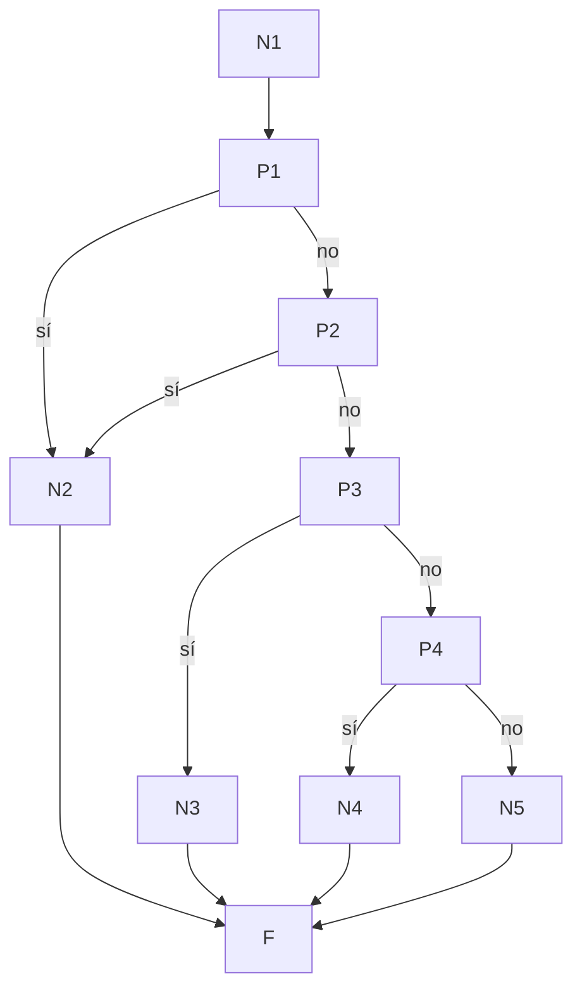

# Prueba de caja blanca 04 — `verificar_credenciales`

- **Módulo:** `itdb_ctf/auth/local_auth.py`
- **Función:** `verificar_credenciales(email, password) -> Usuario | None`
- **Propósito:** validar el ingreso con email y contraseña (login local). Solo
  acepta cuentas de método `local`, con contraseña definida y activas.
- **Técnica:** camino básico (McCabe) + cobertura de ramas con `pytest-cov`.
- **Archivo de pruebas:** `tests/test_04_verificar_credenciales.py`

---

## 1. Código fuente con nodos numerados

```python
 6  def verificar_credenciales(email, password):
 7      with Session(engine) as s:                                   # N1
 8          metodo_auth = ...where(etiqueta == "local").one()        # N1
 9          usuario = ...where(email_inst == email, metodo local)    # N1
11          if not usuario or not usuario.password_hash:             # P1 (not usuario) / P2 (sin hash)
12              return None                                          # N2
13          if not usuario.activo:                                   # P3
14              return None                                          # N3
15          if hasher.verificar(password, usuario.password_hash):    # P4 (bcrypt)
16              return usuario                                       # N4
17          return None                                              # N5
                                                                     # F (fin)
```

La condición compuesta de la línea 11 se separa en P1 y P2.

## 2. Grafo de flujo



## 3. Complejidad ciclomática V(G)

| Método | Cálculo | Resultado |
|---|---|---|
| Nodos predicado | P = 4 → V(G) = P + 1 | **5** |
| Aristas y nodos | E = 13, N = 10 → V(G) = 13 − 10 + 2 | **5** |
| Regiones | 4 cerradas + 1 exterior | **5** |

## 4. Caminos independientes

| Camino | Recorrido | Descripción |
|---|---|---|
| C1 | N1 → P1(sí) → N2 → F | No hay cuenta local con ese email |
| C2 | N1 → P1(no) → P2(sí) → N2 → F | Cuenta local sin contraseña (placeholder) |
| C3 | … → P2(no) → P3(sí) → N3 → F | Cuenta desactivada |
| C4 | … → P3(no) → P4(no) → N5 → F | Contraseña incorrecta |
| C5 | … → P3(no) → P4(sí) → N4 → F | Credenciales correctas |

Todos los caminos son factibles.

## 5. Casos de prueba

Cada caso parte de una BD vacía; la contraseña de prueba es `Clave_Segura_2026`,
guardada como hash bcrypt (igual que en la app).

C1 se prueba dos veces por partición de equivalencia: email que no existe, y
email que **sí** existe pero como cuenta de Google (la consulta filtra por método
`local`, así que tampoco se encuentra). Esto demuestra que una cuenta Google no
puede entrar por el formulario local.

| Caso | Test | Precondición | Entrada | Esperado | Obtenido |
|---|---|---|---|---|---|
| C1a | `test_C1_email_no_registrado` | BD sin usuarios | email inexistente | `None` | Aprobado |
| C1b | `test_C1b_cuenta_google_no_entra_por_login_local` | Cuenta Google con ese email | email + clave | `None` | Aprobado |
| C2 | `test_C2_cuenta_local_sin_contrasena` | Cuenta local con `password_hash = NULL` | email + clave | `None` | Aprobado |
| C3 | `test_C3_cuenta_inactiva` | Cuenta local, clave correcta, `activo = False` | email + clave | `None` | Aprobado |
| C4 | `test_C4_contrasena_incorrecta` | Cuenta local activa | email + `otra_clave` | `None` | Aprobado |
| C5 | `test_C5_credenciales_correctas` | Cuenta local activa | email + clave | el `Usuario` (mismo `id_usuario`) | Aprobado |

## 6. Resultados y cobertura

Ejecución: `pytest tests/test_04_verificar_credenciales.py --cov=itdb_ctf.auth.local_auth --cov-branch --cov-report=term-missing`
(2026-10-02, Python 3.14.5, pytest 9.1.1, BD `ctf_itdb_test`).

**6 de 6 casos aprobados.**

| Función | Sentencias cubiertas | Ramas parciales | Cobertura |
|---|---|---|---|
| `verificar_credenciales` | 11 / 11 | 0 | **100 %** |
