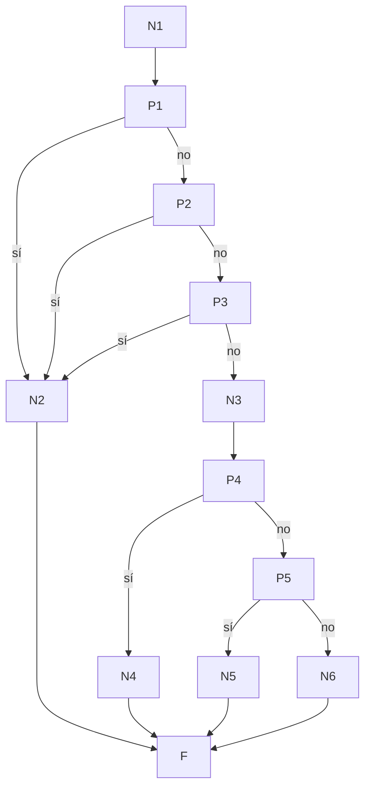

# Prueba de caja blanca 05 — `acceso_evento_cerrado`

- **Módulo:** `itdb_ctf/evento_cerrado/evento_cerrado_logic.py`
- **Función:** `acceso_evento_cerrado(id_evento, id_usuario) -> (bool, str)`
- **Propósito:** decidir si un estudiante puede entrar a los retos de un evento
  cerrado: el evento debe existir, estar activo, ser cerrado, estar en curso, y el
  estudiante debe estar inscrito y no descalificado.
- **Técnica:** camino básico (McCabe) + cobertura de ramas con `pytest-cov`.
- **Archivo de pruebas:** `tests/test_05_acceso_evento_cerrado.py`

---

## 1. Código fuente con nodos numerados

```python
21  def acceso_evento_cerrado(id_evento, id_usuario):
24      with Session(engine) as s:                                   # N1
25          ev = s.get(Evento, id_evento)                            # N1
26          if not ev or not ev.activo or etiqueta_modalidad(...) != "cerrado":
                                                                     # P1 / P2 / P3
27              return False, "Evento no encontrado."                # N2
28          est = estado_evento(ev)                                  # N3
29          if est == "concluido":                                   # P4
30              return False, "Evento culminado."                    # N4
31          if est == "futuro":                                      # P5
32              return False, "El evento aún no inicia."             # N5
33-35       ok, msg = estado_inscripcion(...); return ok, msg        # N6
                                                                     # F (fin)
```

La condición de la línea 26 tiene tres partes y se separa en P1 (no existe),
P2 (desactivado) y P3 (no es cerrado).

`estado_inscripcion` (N6) es otra función que devuelve tres resultados posibles:
inscrito `(True, "")`, sin inscripción y descalificado. Dentro de este grafo es un
solo nodo, pero el camino C6 se prueba con sus **tres** salidas para comprobar que
el resultado se devuelve tal cual.

## 2. Grafo de flujo



## 3. Complejidad ciclomática V(G)

| Método | Cálculo | Resultado |
|---|---|---|
| Nodos predicado | P = 5 → V(G) = P + 1 | **6** |
| Aristas y nodos | E = 16, N = 12 → V(G) = 16 − 12 + 2 | **6** |
| Regiones | 5 cerradas + 1 exterior | **6** |

## 4. Caminos independientes

| Camino | Recorrido | Descripción |
|---|---|---|
| C1 | N1 → P1(sí) → N2 → F | El evento no existe |
| C2 | N1 → P1(no) → P2(sí) → N2 → F | El evento está desactivado |
| C3 | … → P2(no) → P3(sí) → N2 → F | El evento es el abierto, no uno cerrado |
| C4 | … → P3(no) → N3 → P4(sí) → N4 → F | El evento ya terminó |
| C5 | … → P4(no) → P5(sí) → N5 → F | El evento aún no empieza |
| C6 | … → P5(no) → N6 → F | Evento en curso: decide la inscripción |

Todos los caminos son factibles.

## 5. Casos de prueba

En C2 a C5 el estudiante **está inscrito**, para demostrar que lo bloquea el
estado del evento y no la falta de inscripción.

| Caso | Test | Precondición | Esperado | Obtenido |
|---|---|---|---|---|
| C1 | `test_C1_evento_inexistente` | `id_evento = 9999` | `(False, "Evento no encontrado.")` | Aprobado |
| C2 | `test_C2_evento_desactivado` | Evento cerrado en curso con `activo = False` | `(False, "Evento no encontrado.")` | Aprobado |
| C3 | `test_C3_evento_abierto_no_es_cerrado` | Evento de modalidad abierta | `(False, "Evento no encontrado.")` | Aprobado |
| C4 | `test_C4_evento_concluido` | Evento que terminó ayer | `(False, "Evento culminado.")` | Aprobado |
| C5 | `test_C5_evento_futuro` | Evento que empieza mañana | `(False, "El evento aún no inicia.")` | Aprobado |
| C6a | `test_C6_…[inscrito]` | Evento en curso, estudiante inscrito | `(True, "")` | Aprobado |
| C6b | `test_C6_…[sin_inscripcion]` | Evento en curso, sin inscripción | `(False, "No estas inscrito en este evento.")` | Aprobado |
| C6c | `test_C6_…[descalificado]` | Evento en curso, estudiante descalificado | `(False, "Has sido desacalificado de el evento.")` | Aprobado |

## 6. Resultados y cobertura

Ejecución: `pytest tests/test_05_acceso_evento_cerrado.py --cov=itdb_ctf.evento_cerrado.evento_cerrado_logic --cov-branch --cov-report=term-missing`
(2026-10-02, Python 3.14.5, pytest 9.1.1, BD `ctf_itdb_test`).

**8 de 8 casos aprobados.**

| Función | Sentencias cubiertas | Ramas parciales | Cobertura |
|---|---|---|---|
| `acceso_evento_cerrado` (líneas 21–35) | 12 / 12 | 0 | **100 %** |

El reporte de `pytest-cov` muestra el archivo completo al 60 %: las líneas sin
cubrir (40-46, 52-56, 60-64) son de `acceso_publico_evento_cerrado` y
`acceso_perfil_evento_cerrado`, que no forman parte de esta prueba.
