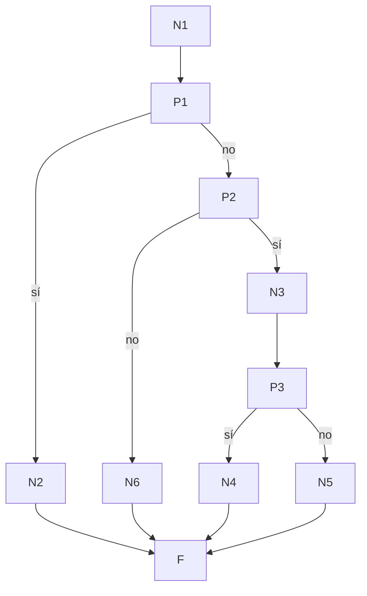

# Prueba de caja blanca 06 — `permitir_flag` (rate limit de flags)

- **Módulo:** `itdb_ctf/core/rate_limit.py`
- **Función:** `permitir_flag(id_usuario, id_reto) -> (permitido: bool, segundos_restantes: int)`
- **Propósito:** frenar la fuerza bruta de flags: máximo **15 envíos por minuto**
  por cada par (usuario, reto). El contador vive en Redis; si Redis no está, se
  permite el envío (*fail-open*) para no bloquear la competencia.
- **Técnica:** camino básico (McCabe) + cobertura de ramas con `pytest-cov`.
- **Archivo de pruebas:** `tests/test_06_permitir_flag.py`

---

## 1. Código fuente con nodos numerados

```python
177  def permitir_flag(id_usuario, id_reto):
178      clave = _clave_flag(id_usuario, id_reto)        # N1
179      limite, ventana = FLAG                          # N1   (15, 60)
180      n = _redis_incr(clave, ventana)                 # N1   suma 1 y devuelve el total
181      if n is None:                                   # P1   ¿Redis no disponible?
182          return True, 0                              # N2   fail-open
183      if n > limite:                                  # P2   ¿superó 15?
184          r = _redis_peek(clave)                      # N3   consulta cuánto falta
185          return False, (r[1] if r else ventana)      # P3 → N4 (r[1]) / N5 (ventana)
186      return True, 0                                  # N6
                                                         # F (fin)
```

La línea 185 contiene un `if` en una sola línea (operador ternario); McCabe lo
cuenta como un predicado más (P3).

## 2. Grafo de flujo



## 3. Complejidad ciclomática V(G)

| Método | Cálculo | Resultado |
|---|---|---|
| Nodos predicado | P = 3 → V(G) = P + 1 | **4** |
| Aristas y nodos | E = 12, N = 10 → V(G) = 12 − 10 + 2 | **4** |
| Regiones | 3 cerradas + 1 exterior | **4** |

## 4. Caminos independientes

| Camino | Recorrido | Descripción |
|---|---|---|
| C1 | N1 → P1(sí) → N2 → F | Redis caído → se permite (fail-open) |
| C2 | N1 → P1(no) → P2(no) → N6 → F | Dentro del límite → se permite |
| C3 | … → P2(sí) → N3 → P3(sí) → N4 → F | Superó el límite → bloquea con el tiempo restante real |
| C4 | … → P2(sí) → N3 → P3(no) → N5 → F | Superó el límite y Redis falla al consultar el tiempo → bloquea 60 s |

Todos los caminos son factibles. C4 ocurre si Redis se cae justo entre el
conteo y la consulta del tiempo; en la prueba se simula reemplazando
`_redis_peek` por una función que devuelve `None` (técnica de *stub*).

## 5. Casos de prueba

Redis es reemplazado por `fakeredis` (Redis en memoria), que se vacía antes de
cada caso. Para C1 se marca Redis como caído.

C2 aplica **valor límite**: el 1.er intento y el 15.º (el último permitido).
C3 prueba el 16.º (el primero bloqueado) y además que otro reto tiene su propio
contador.

| Caso | Test | Precondición | Entrada | Esperado | Obtenido |
|---|---|---|---|---|---|
| C1 | `test_C1_sin_redis_permite` | Redis caído | 20 intentos | todos `(True, 0)` | Aprobado |
| C2a | `test_C2_dentro_del_limite[primer_intento]` | Contador en 0 | intento 1 | `(True, 0)` | Aprobado |
| C2b | `test_C2_dentro_del_limite[intento_15_limite]` | 14 intentos previos | intento 15 | `(True, 0)` | Aprobado |
| C3 | `test_C3_supera_limite` | 15 intentos previos | intento 16 | `(False, t)` con 1 ≤ t ≤ 60; otro reto sigue `(True, 0)` | Aprobado |
| C4 | `test_C4_supera_limite_y_falla_la_consulta_del_ttl` | 15 intentos previos, `_redis_peek` devuelve `None` | intento 16 | `(False, 60)` | Aprobado |

## 6. Resultados y cobertura

Ejecución: `pytest tests/test_06_permitir_flag.py --cov=itdb_ctf.core.rate_limit --cov-branch --cov-report=term-missing`
(2026-10-02, Python 3.14.5, pytest 9.1.1).

**5 de 5 casos aprobados.**

| Función | Sentencias cubiertas | Ramas parciales | Cobertura |
|---|---|---|---|
| `permitir_flag` (líneas 177–186) | 10 / 10 | 0 | **100 %** |

El reporte de `pytest-cov` muestra el archivo completo al 45 %: el resto del
archivo es el rate limit del **login** (`login_bloqueado`, `registrar_fallo_login`,
respaldo en memoria…), que no forma parte de esta prueba.
